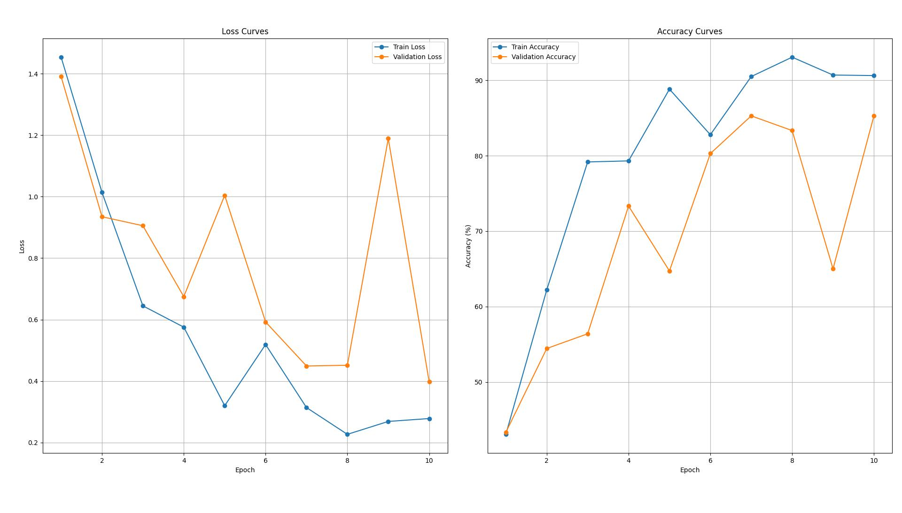
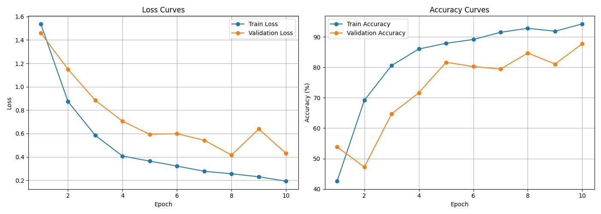
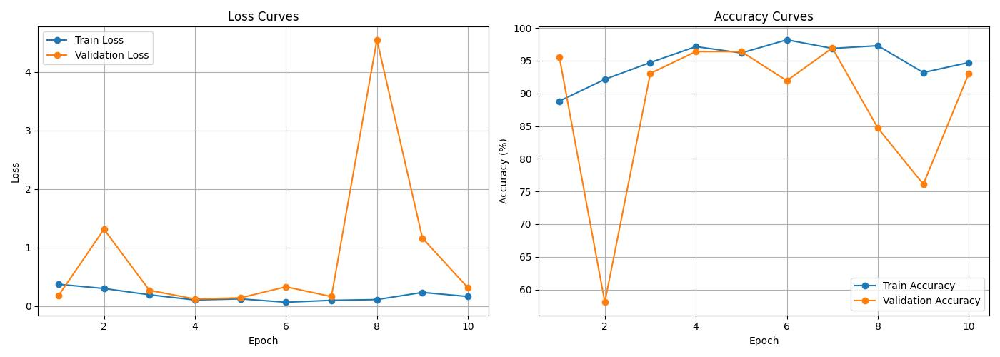
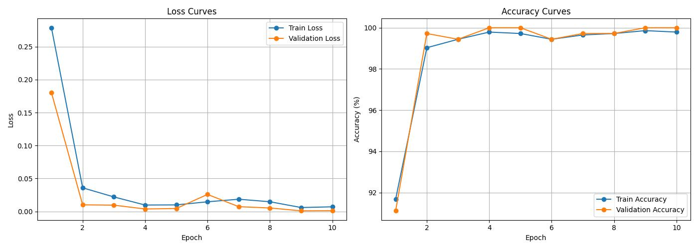

# Experiments and Model Development

This document tracks the iterative development process of the steel surface defect classification pipeline.

---

# Experiment 1 - Baseline CNN

## Configuration

- Custom CNN trained from scratch
- No normalization
- No data augmentation
- No checkpoint saving

## Training Curves



## Best Result

| Metric | Value |
|---|---|
| Train Accuracy | 93.06% |
| Validation Accuracy | 85.28% |
| Validation Loss | 0.3977 |

## Observations

- Model learned major defect patterns successfully.
- Validation performance plateaued around 85%.
- Validation fluctuations indicated overfitting and unstable generalization.
- The custom CNN architecture appeared limited in representational capacity.

## Next Changes

- Add normalization
- Add augmentation
- Add checkpoint saving
- Improve generalization stability

---

# Experiment 2 - Normalization + Augmentation

## Changes Introduced

- Added ImageNet normalization
- Added random horizontal flip
- Added random rotation
- Added color jitter
- Added best model checkpoint saving

## Training Curves



## Best Result

| Metric | Value |
|---|---|
| Train Accuracy | 94.31% |
| Validation Accuracy | 87.78% |
| Validation Loss | 0.4305 |

## Observations

- Validation accuracy improved compared to baseline CNN.
- Generalization became more stable.
- Augmentation reduced overfitting effects.
- Performance improvement remained limited by the custom CNN architecture.

## Next Changes

- Replace custom CNN with transfer learning architecture
- Use pretrained feature extractor

---

# Experiment 3 - Transfer Learning with ResNet18

## Changes Introduced

- Replaced custom CNN with pretrained ResNet18
- Fine-tuned final classification layer for 6 defect classes

## Training Curves



## Best Result

| Metric | Value |
|---|---|
| Train Accuracy | 98.19% |
| Validation Accuracy | 96.94% |
| Validation Loss | 0.1189 |

## Observations

- Validation accuracy improved significantly.
- Convergence became substantially faster.
- Validation instability appeared during later epochs.
- Large validation loss spikes suggested unstable optimization during fine-tuning.

## Identified Issue

Learning rate appeared too high for pretrained transfer learning.

## Next Changes

- Reduce learning rate
- Stabilize fine-tuning updates

---

# Experiment 4 - Learning Rate Tuning

## Changes Introduced

- Reduced learning rate:

```text
0.001 → 0.0001
```

- Continued training using pretrained ResNet18

## Training Curves



## Best Result

| Metric | Value |
|---|---|
| Train Accuracy | 99.86% |
| Validation Accuracy | 100.00% |
| Validation Loss | 0.0009 |

## Observations

- Training stabilized significantly.
- Validation fluctuations disappeared.
- Fine-tuning behavior became smooth and consistent.
- Transfer learning generalized extremely well on this dataset.

---

# Final Model

## Final Architecture

- ResNet18 Transfer Learning

## Final Training Configuration

| Hyperparameter | Value |
|---|---|
| Learning Rate | 0.0001 |
| Batch Size | 32 |
| Epochs | 10 |
| Image Size | 224×224 |

## Final Outcome

The final transfer learning pipeline achieved near-perfect validation performance on the NEU Surface Defect Database with stable optimization behavior and strong generalization.